# Refactored Digital Navigation Tool

### Track symbol (***example for simulation***)
The following table describes the track label - type of ***sim*** - fields.
<table>
<tr>
<th colspan="2">Track Symbol Presentation</th>
</tr>
<tr>
    <td colspan="2">Default label presentation without active input fields</td>
</tr>
<tr><td colspan="2" align="center">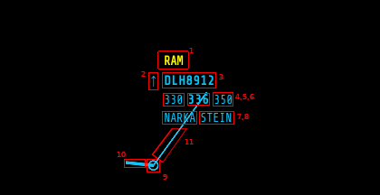</td></tr>
<tr>
    <th>Id</th>
    <th>Description</th>
</tr>
<tr>
    <td align="center">1</td>
    <td>Alert text: UI.UpdateTRACK({..., alert: [0,1,2,3,4,5,6,7]})</td>
</tr>
<tr>
    <td align="center">2</td>
    <td>Attitude indicator: UI.UpdateTRACK({..., attitude: [-1,0,1]})</td>
</tr>
<tr>
    <td align="center">3</td>
    <td>Callsign: UI.UpdateTRACK({..., callsign: "new callsign"})</td>
</tr>
<tr>
    <td align="center">4</td>
    <td>Entry level: UI.UpdateTRACK({..., efl: [0..660]})</td>
</tr>
<tr>
    <td align="center">5</td>
    <td>Actual level: UI.UpdateTRACK({..., cfl: [0..660]})*</td>
</tr>
<tr>
    <td align="center">6</td>
    <td>Exit level: UI.UpdateTRACK({..., xfl: [0..660]})</td>
</tr>
<tr>
    <td align="center">7</td>
    <td>COPN: UI.UpdateTRACK({..., copn: "copn"})</td>
</tr>
<tr>
    <td align="center">8</td>
    <td>COPX: UI.UpdateTRACK({..., copx: "copx"})**</td>
</tr>
<tr>
    <td colspan="2">** <em>Clicking on the COPX field, the heading selector window pops up. See below the sample.</em></td>
</tr>
<tr>
    <td colspan="2" align="center">
        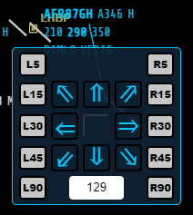
    </td>
</tr>
<tr>
    <td align="center">9</td>
    <td>Track position indicator</td>
</tr>
<tr>
    <td align="center">10</td>
    <td>Track heading indicator - if available</td>
</tr>
<tr>
    <td align="center">11</td>
    <td>Label stick</td>
</tr>
<tr>
    <td colspan="2">* Default label presentation with active input fields - <b>CFL</b> input</td>
</tr>
<tr>
    <td colspan="2" align="center">
        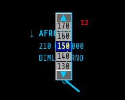
        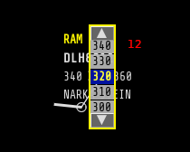
        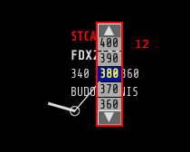
    </td>
</tr>
<tr>
    <td align="center">12</td>
    <td>Label CFL input list</td>
</tr>
</table>

### Known statuses and alerts

The track statuses and alerts can be modified independently or in batch operation with other track parameter modifications.

<table>
<thead>
<tr>
<th colspan="3">Track Status</th>
</tr>
<tr>
<th>Code</th>
<th>Description</th>
<th>Label presentation on UI</th>
</tr>
</thead>
<tbody>

<tr>
<td>0</td>
<td>Hidden</td>
<td>Not visible on UI</td>
</tr>

<tr>
<td>1</td>
<td>Unconcerned</td>
<td>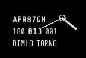</td>
</tr>

<tr>
<td>2</td>
<td>Preactivated</td>
<td>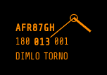</td>
</tr>

<tr>
<td>3</td>
<td>Active</td>
<td>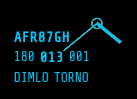</td>
</tr>

<tr>
<td colspan="3">The alerts - if set - appears on the top of the label. The alert text color applied on each alert status. Now I demonstrate alert on a sample active label.</td>
</tr>

<tr>
<td>0</td>
<td>No alert</td>
<td>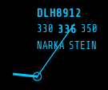</td>
</tr>

<tr>
<td>1</td>
<td>RAM warning</td>
<td>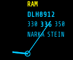</td>
</tr>

<tr>
<td>2</td>
<td>CLAM warning</td>
<td>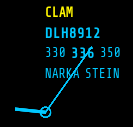</td>
</tr>

<tr>
<td>3</td>
<td>STCW warning</td>
<td>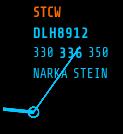</td>
</tr>

<tr>
<td>4</td>
<td>DAIW alert</td>
<td>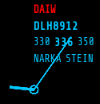</td>
</tr>

<tr>
<td>5</td>
<td>STCA alert</td>
<td>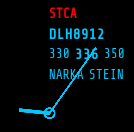</td>
</tr>

<tr>
<td>6</td>
<td>CRASH alert</td>
<td>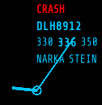</td>
</tr>

<tr>
<td>7</td>
<td>Out of Sector alert</td>
<td>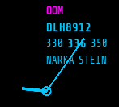</td>
</tr>
</tbody>
</table>

### Characteristic point selector example

If user activates the heading selector window's input field, the field will contain the actual magnetic heading when the container window appears on the screen. If the virtual pilot wants to change the flight direction - using this mode, there are two options avaialble to achieve this.

    a. Track heading modification: entering numeric value between range 0 - 359
        degrees. After ENTER key pressed, the track will begin the turn - to 
        the *_shortest_* angle toward the desired track angle.
    
    b. Type the name of the characteristic point - as the desired point name
        forms in the input field, the list of the partially matched entries
        from the characteristic points database will appear in a selection
        window list. Clicking on the desired point, the track will find the
        *_shortest_* angle to turn as above.

*Please note: if input field background is not green, that means the point name could not be validated by pressing the ENTER key. Otherwise the app will look for the entered name in the database.*

*However it is still allowed to **quick-select** a point from the list by left clicking on the element in the list with mouse pointer.*

In the latter case when virtual pilot starts to type the name of the characteristic point, its firs letter - and the redish background - indicates that the point is not defined (**at least two characters must be given in the input to be able to validate the point name**) The following image will present this phase of heading change using characteristic point.

    <table width="100%">
        <thead>
            <tr>
                <th>Heading selection with characteristic point name: one letter is in the input</th>
            </tr>
        </thead>
        <tbody>
            <td align="center">
                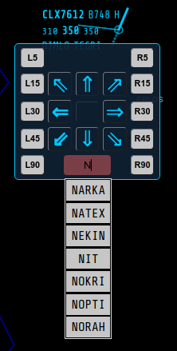
            </td>
        </tbody>
        <thead>
            <tr>
                <th>Heading selection with characteristic point name: two letters are in the input</th>
            </tr>
        </thead>
        <tbody>
            <td align="center">
                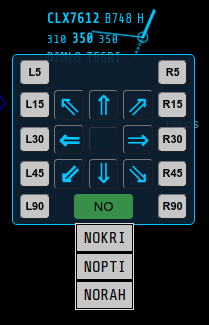
            </td>
        </tbody>
        <thead>
            <tr>
                <th>Heading selection with characteristic point name: two letters are in the input and the point selected</th>
            </tr>
        </thead>
        <tbody>
            <td align="center">
                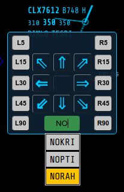
            </td>
        </tbody>
    </table>

**Please NOTE that, the rolldown selection windows as well as the heading selector window itself would position themshelves out of the viewport if the target label is close enough to the border of the viewport.**

Therefore is adviced to pan the viewport according to the position of the track label the user wants to work with.

*-zg-*